## Создание технологии "Tiny Blockchain" на Python

Блокчейн — это распределённая база данных, в которой информация хранится в виде цепочки блоков. Каждый блок содержит данные, хеш предыдущего блока и уникальное число (proof-of-work), обеспечивающее защиту от изменений.

### Основные компоненты блокчейна:

- **Блок** — структура данных, содержащая полезную нагрузку и служебную информацию.
- **Хеш** — результат криптографической функции, позволяющий идентифицировать блок и обеспечить целостность данных.
- **Proof-of-Work** — механизм консенсуса, требующий выполнения вычислений перед добавлением блока.
- **Цепочка блоков (Blockchain)** — упорядоченная структура, где каждый блок связан с предыдущим.

Цель технологии — реализовать минимальную, работающую версию блокчейна, демонстрирующую его базовые принципы: создание блоков, связывание их через хеши, подтверждение с помощью proof-of-work, а также взаимодействие с пользователем через веб-интерфейс.

---

### Шаг 1: Подготовка среды

- Установите Python (версия 3.8+).
- Установите PyCharm или другой редактор кода.
- Создайте новый проект и файл `blockchain.py`.
- Установите Flask:
  ```bash
  pip install Flask
  ```

---

### Шаг 2: Создание класса `Blockchain`

Создаём класс `Blockchain`, отвечающий за хранение блоков, обработку транзакций и Proof of Work.

Метод `__init__()` инициализирует пустую цепочку и список текущих транзакций. Также создаётся генезис-блок (первый блок в блокчейне).

- 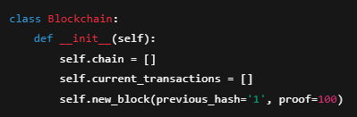

---

### Шаг 3: Метод `new_block()`

Метод `new_block()` добавляет новый блок в цепочку после завершения доказательства работы.

- 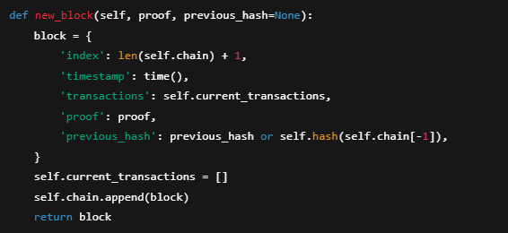

---

### Шаг 4: Метод `new_transaction()`

Создаёт транзакцию и добавляет её в пул текущих, которые будут включены в следующий блок.

- 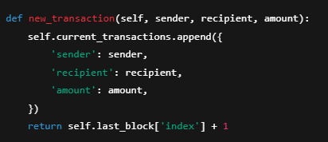

---

### Шаг 5: Хеш-функция и Proof of Work

Хеширует блок и реализует простую систему доказательства работы (PoW), где нужно найти число, дающее хеш с четырьмя нулями в начале.

- 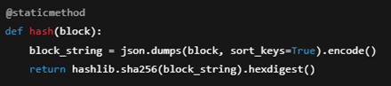
- 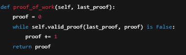

---

### Шаг 6: Flask-сервер

Создаём веб-сервер на Flask для взаимодействия с блокчейном:

```python
from flask import Flask
app = Flask(__name__)
blockchain = Blockchain()
```

#### Роут `/mine`

Создаёт новый блок.

- 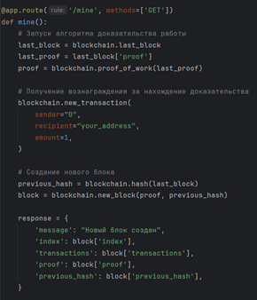
- 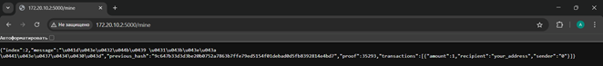

#### Роут `/transactions/new`

Добавляет новую транзакцию.

- 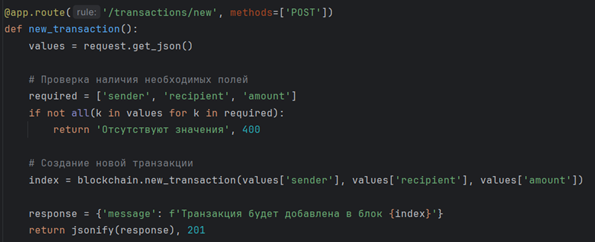

#### Роут `/chain`

Отдаёт всю цепочку блоков.

- 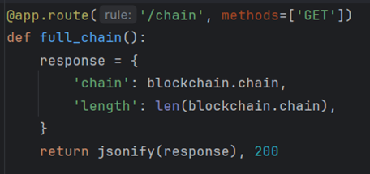
- 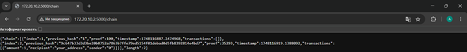

---

### Шаг 7: Запуск сервера

- 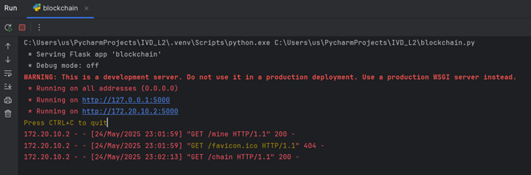

---

### Шаг 8: Завершающий этап

1. Отправляем POST-запрос на `/transactions/new` с транзакцией.
2. Делаем GET-запрос на `/mine` — транзакция попадает в блок.
3. Получаем цепочку через `/chain`.

---

## Итог

В результате выполнения всех шагов вы создали минимальный, но полностью рабочий блокчейн. Он умеет:

- добавлять новые блоки с транзакциями;
- выполнять proof-of-work для защиты от подделки;
- обеспечивать связность цепочки блоков с помощью хешей;
- обрабатывать транзакции и взаимодействовать через API.

Этот простой проект помогает понять, как устроены основные механизмы блокчейна и может служить отправной точкой для более сложных разработок.
